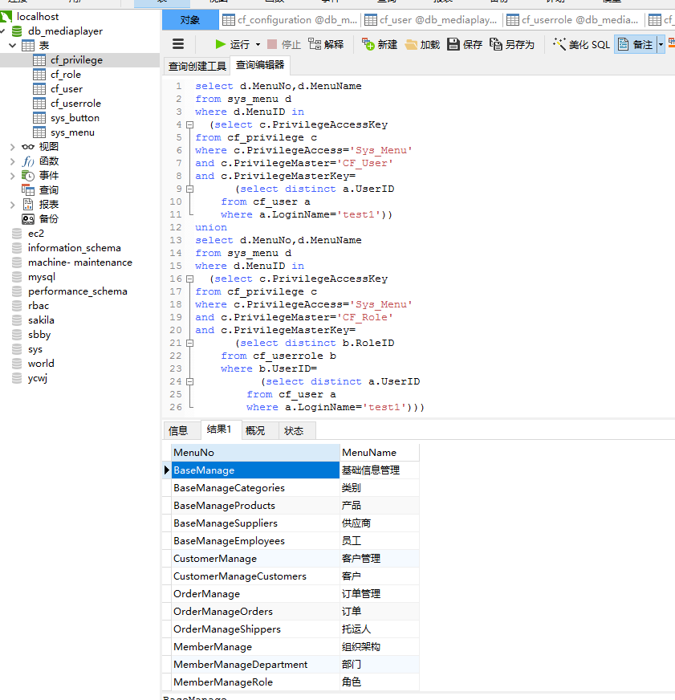

# sixthwork 
##查询test1可以查看的页面:共19条记录 

1.	根据用户的登录名test1在用户表里查对应的userid 
2.	根据userid去权限表里查对应的访问人类型为user、访问对象类型为Menu的对应的Menuid 
3.	根据Menuid去菜单（页面）表里查对应的菜单（页面）名称Menuname 
4.	 根据用户的登录名test1在用户表里查对应的userid 
5.	根据userid去用户角色表里查对应的roleid 
6.	根据roleid去权限表里查对应的访问人类型为role、访问对象类型为Menu的对应的Menuid 
7.	根据Menuid去菜单（页面）表里查对应的菜单（页面）名称Menuname 
8.	将第三步得到的菜单（页面）名称与第七步得到的菜单（页面）名称取并集 

##查询test1可以对order页面进行的操作:共4条记录 

1.	根据用户的登录名test1在用户表里查对应的userid 
2.	根据userid去权限表里查对应的访问人类型为user、访问对象类型为button的对应的buttonid 
3.	根据页面名称order去菜单（页面）表里查对应的MenuNo 
4.	根据MenuNo以及buttonid去按钮表里面查对应的操作名称buttonname 
5.	根据用户的登录名test1在用户表里查对应的userid 
6.	根据userid去用户角色表里查对应的roleid 
7.	根据roleid去权限表里查对应的访问人类型为role、访问对象类型为button的对应的buttonid 
8.	根据页面名称order去菜单（页面）表里查对应的MenuNo 
9.	根据MenuNo以及buttonid去按钮表里面查对应的操作名称buttonname 
10.	将第四步得到的操作名称与第九步得到的操作名称取并集 

